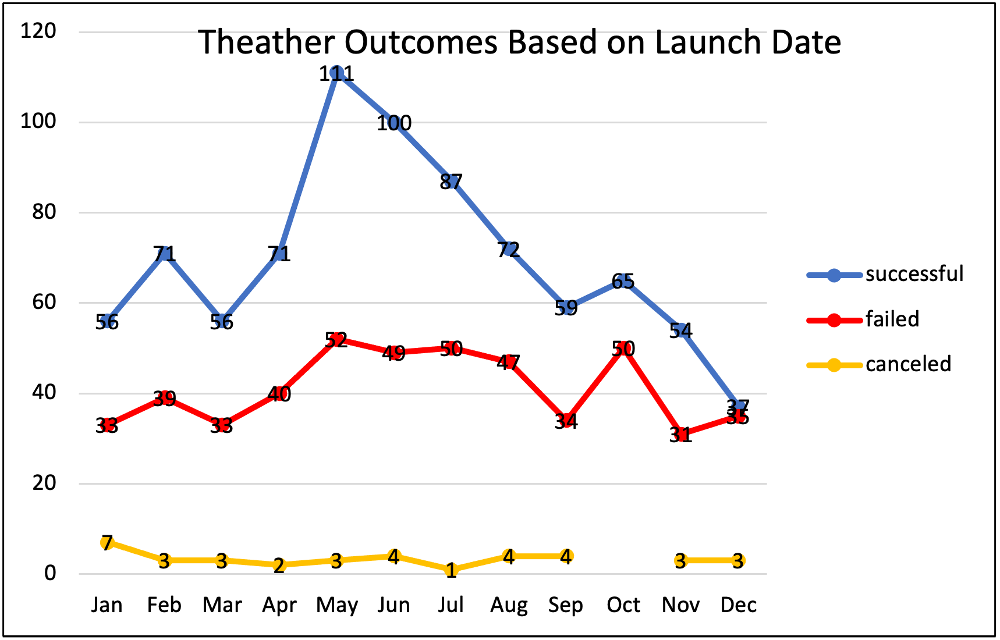

# Kickstarting with Excel

## Overview of Kickstarter Project

### Purpose
The purpose of the kickstarter project is to help Louise identify what goal she should set her play at in order for it to have the best chance at succeeding. We have access to thousands of kickstarters that range from all types of categories	and subcategories and have the information of their goals and what was actually pledged. 
## Analysis and Challenges

### Analysis of Outcomes Based on Launch Date

![Outcomes based on Goals](
### Analysis of Outcomes Based on Goals

### Challenges and Difficulties Encountered

## Results

- What are two conclusions you can draw about the Outcomes based on Launch Date?

- What can you conclude about the Outcomes based on Goals?

- What are some limitations of this dataset?

- What are some other possible tables and/or graphs that we could create?
