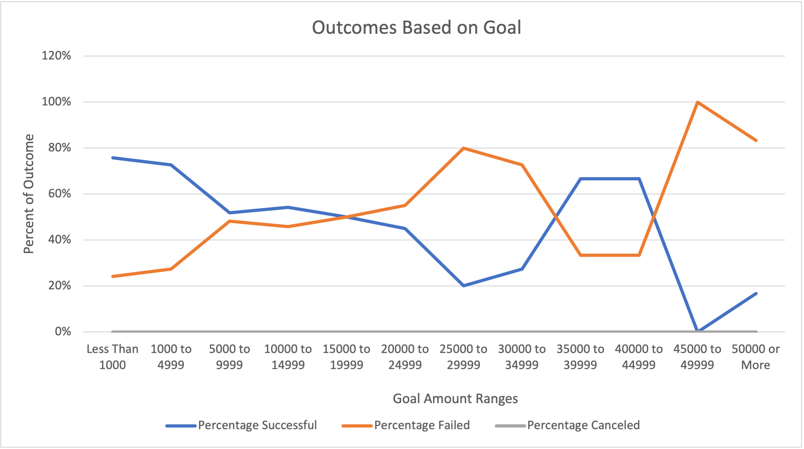

# Kickstarting with Excel

## Overview of Kickstarter Project

### Purpose
The purpose of the kickstarter project is to help Louise identify what goal she should set her play at in order for it to have the best chance at succeeding. We have access to thousands of kickstarters that range from all types of categories	and subcategories and have the information of their goals and what was actually pledged. 
## Analysis and Challenges

### Analysis of Outcomes Based on Launch Date

### Analysis of Outcomes Based on Goals

### Challenges and Difficulties Encountered
Due to the very comprehensive material on the modules, i did not encounter too many challenges. However, the few I did encounter revolved around the formulas in the data set. More specifically during the second dileverable i had a dificult time filling up column B because I kept doing the the formula wrong and i didn't understand why. After much 

## Results

- What are two conclusions you can draw about the Outcomes based on Launch Date?

- What can you conclude about the Outcomes based on Goals?

- What are some limitations of this dataset?
Looking at more fields like more time 
Looking at this you can only see plays in the theater category but if yoiu want musicals this is beyond
scope is limited to plays not beyond that unless you create new data

- What are some other possible tables and/or graphs that we could create?
